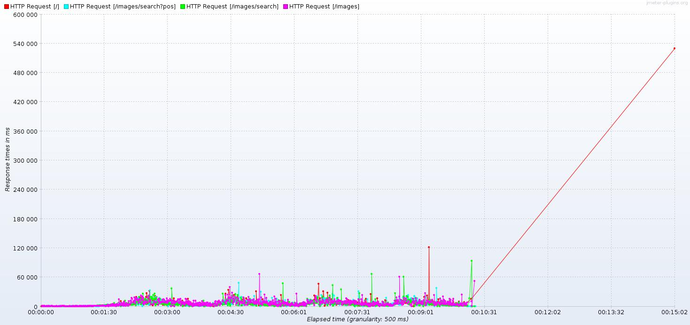

# Результаты нагрузочного тестирования

Нагрузка Яндекса!

Цель: Разработает тестовый скрипт нагрузочного тестирования, проведет тестирование, проанализирует результаты.
1. По полученным навыкам на вебинаре - разработайте скрипт работы с сайтом яндекса:
- переход на главную страницу
- переход в раздел картинок
- поиск картинки "котики" (или любой другой)
- переход на найденному url из ответа системы
2. Проведите нагрузочный тест в несколько потоков в течение не менее 10 минут
3. Проанализируйте полученный результат и дайте ответ на вопрос - какие выводы можно сделать по результатам? Оформите выводы в виде краткого отчета

## Отчет

Инструмент НТ: apache-jmeter-5.2.1

Скрипт: test_plan.jmx
-  Arrivals Thread Group
    - Target Rate (arrivals/sec): 20
    - Ramp Up Time (sec): 180
    - Ramp Up Step Count: 10
    - Hold Target Rate Time (sec): 420

Отчет: aggregate

|Label                            |# Samples|Average|Median|90% Line|95% Line|99% Line|Min|Max   |Error %|Throughput|Received KB/sec|Sent KB/sec|
|---------------------------------|---------|-------|------|--------|--------|--------|---|------|-------|----------|---------------|-----------|
|HTTP Request [/]                 |2722     |4874   |3146  |10160   |13560   |25486   |444|530422|0.037% |3.01746   |433.35         |3.77       |
|HTTP Request [/images]           |2721     |5863   |3696  |12990   |16246   |25704   |591|150045|0.110% |4.41470   |246.79         |11.07      |
|HTTP Request [/images/search]    |2721     |4501   |2971  |9829    |13753   |23411   |563|134869|0.000% |4.41682   |525.41         |5.62       |
|HTTP Request [/images/search?pos]|2721     |4637   |3109  |10282   |13742   |23596   |563|154563|0.037% |4.41462   |527.65         |6.22       |
|TOTAL                            |10885    |4969   |3128  |11061   |14891   |24891   |444|530422|0.046% |12.06652  |1321.32        |19.42      |

Отчет: Response Times Over Time

## Итого:

При нагрузке 20 req/sec получаем следующие показатели:
- Пропускная способность: 12.066 req / sec
- Среднее время обработки запроса: 4,969 сек
- Всего обработано запросов за 10 мин: 10885
- Количество ошибок: 0.046 %

