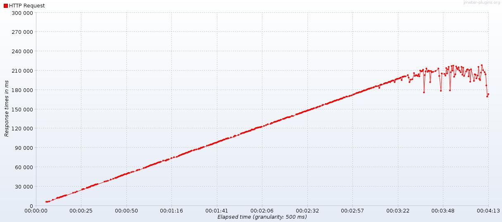
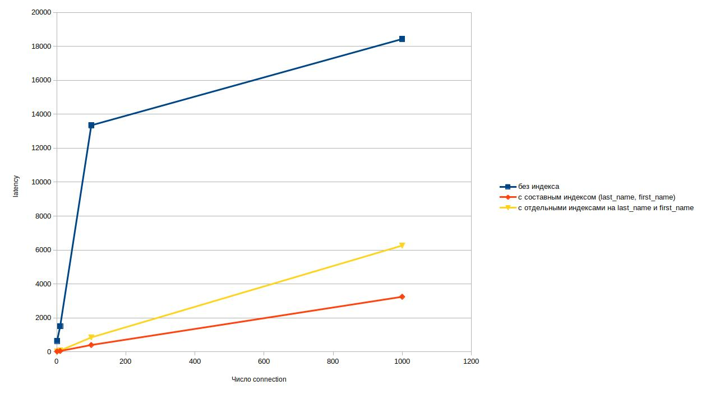
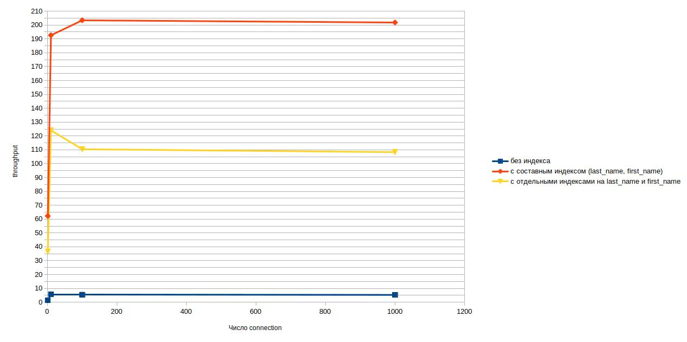

# Результаты нагрузочного тестирования

Производительность индеков

Цель: В результате выполнения ДЗ вы создадите набор тестовых данных для проведения нагрузочного тестирования, подберете наиболее подходящие индексы и проведете тесты производительности. В данном задании тренируются навыки: - генерация тестовых данных; - работа с индексами; - нагрузочное тестирование;

1) Сгенерировать любым способ 1,000,000 анкет. Имена и Фамилии должны быть реальными (чтобы учитывать селективность индекса)
2) Реализовать функционал поиска анкет по префиксу имени и фамилии (одновременно) в вашей социальной сети (запрос в форме firstName LIKE ? and secondName LIKE ?). Сортировать вывод по id анкеты. Использовать InnoDB движок.
3) С помощью wrk провести нагрузочные тесты по этой странице. Поиграть с количеством одновременных запросов. 1/10/100/1000.
4) Построить графики и сохранить их в отчет
5) Сделать подходящий индекс.
6) Повторить пункт 3 и 4.
7) В качестве результата предоставить отчет в котором должны быть:
- графики latency до индекса;
- графики throughput до индекса;
- графики latency после индекса;
- графики throughput после индекса;
- запрос добавления индекса;
- explain запросов после индекса;
- объяснение почему индекс именно такой;

## Генерация данных

Для генерации тестовых данных используется утилита javafaker

```
1. Удалить в файле ./backend/src/test/kotlin/dev/lysov/sn/FakerTest.kt аннотацию @Disabled
2. Выполнить команду из корня проекта: ./gradlew test --tests "*FakerTest"
3. В результате будет сгенерирован файл insert-account.txt с 1000000 записей
4. Запустить докер (см. корневой README)
5. Скопировать файл insert-account.txt в запущенный контейнер:
docker cp insert-account.txt docker_db_1:/var/tmp
6. Подключиться к mysql в докере (имя контейнера = docker_db_1)
docker exec -it docker_db_1 mysql -uroot -ppassw0rd sn
7. Выполнить вставку данных из файла:
LOAD DATA INFILE '/var/tmp/insert-account.txt'
    INTO TABLE account
    FIELDS TERMINATED BY ';'
    (username, password, first_name, last_name, age, gender, city, description)
    SET ID = NULL;

В результате:
Query OK, 1000000 rows affected (17.98 sec)
```

## Отчет (запрос с OR)

Инструмент НТ: apache-jmeter-5.2.1

Скрипт: sn.jmx
-  Arrivals Thread Group
    - Target Rate (arrivals/sec): 1 / 100 / 1000
    - Ramp Up Time (sec): 0
    - Ramp Up Step Count: 1
    - Hold Target Rate Time (sec): 120
    - Concurrency Limit: 1000
    - Параметризированный HTTP запрос по CSV файлу

### Без индексов

Анализ запроса:

```sql

explain format = json select * from account where first_name like 'Владимир%' or last_name like 'Владимир%';

{
  "query_block": {
    "select_id": 1,
    "cost_info": {
      "query_cost": "105327.73"
    },
    "table": {
      "table_name": "account",
      "access_type": "ALL",
      "rows_examined_per_scan": 992696,
      "rows_produced_per_join": 208323,
      "filtered": "20.99",
      "cost_info": {
        "read_cost": "84495.33",
        "eval_cost": "20832.40",
        "prefix_cost": "105327.73",
        "data_read_per_join": "977M"
      },
      "used_columns": [
        "id",
        "username",
        "password",
        "first_name",
        "last_name",
        "age",
        "gender",
        "city",
        "description"
      ],
      "attached_condition": "((`sn`.`account`.`first_name` like 'Владимир%') or (`sn`.`account`.`last_name` like 'Владимир%'))"
    }
  }
}

explain analyze select * from account where first_name like 'Владимир%' or last_name like 'Владимир%';

-> Filter: ((`account`.first_name like 'Владимир%') or (`account`.last_name like 'Владимир%'))  (cost=105328.48 rows=208324) (actual time=3.707..4651.233 rows=13823 loops=1)
    -> Table scan on account  (cost=105328.48 rows=992696) (actual time=2.558..4383.719 rows=1000001 loops=1)

```

##### Target Rate (arrivals/sec): 1

Отчет: aggregate 

|Label       |# Samples|Average|Median|90% Line|95% Line|99% Line|Min|Max|Error %|Throughput|Received KB/sec|Sent KB/sec|
|------------|---------|-------|------|--------|--------|--------|---|---|-------|----------|---------------|-----------|
|HTTP Request|120      |33     |35    |39      |40      |51      |8  |101|0.000% |1.00814   |18.37          |0.37       |
|TOTAL       |120      |33     |35    |39      |40      |51      |8  |101|0.000% |1.00814   |18.37          |0.37       |

Отчет: Response Times Over Time


Отчет: Transactions per Second


##### Target Rate (arrivals/sec): 100

Отчет: aggregate 

|Label       |# Samples|Average|Median|90% Line|95% Line|99% Line|Min|Max|Error %|Throughput|Received KB/sec|Sent KB/sec|
|------------|---------|-------|------|--------|--------|--------|---|---|-------|----------|---------------|-----------|
|HTTP Request|11999    |10     |10    |12      |14      |22      |4  |97 |0.000% |99.99500  |1821.81        |37.02      |
|TOTAL       |11999    |10     |10    |12      |14      |22      |4  |97 |0.000% |99.99500  |1821.81        |37.02      |

Отчет: Response Times Over Time


Отчет: Transactions per Second


##### Target Rate (arrivals/sec): 1000

Отчет: aggregate 

|Label       |# Samples|Average|Median|90% Line|95% Line|99% Line|Min|Max|Error %|Throughput|Received KB/sec|Sent KB/sec|
|------------|---------|-------|------|--------|--------|--------|---|---|-------|----------|---------------|-----------|
|HTTP Request|38953    |3010   |3097  |3878    |4155    |4803    |67 |10623|0.000% |317.52229 |5784.92        |117.54     |
|TOTAL       |38953    |3010   |3097  |3878    |4155    |4803    |67 |10623|0.000% |317.52229 |5784.92        |117.54     |

Отчет: Response Times Over Time


Отчет: Transactions per Second


### Отдельные индексы на last_name и first_name

```sql
create index account_first_name_idx on account(first_name);
create index account_last_name_idx on account(last_name);
```

Анализ запроса:

```sql

explain format = json select * from account where first_name like 'Владимир%' or last_name like 'Владимир%';

{
  "query_block": {
    "select_id": 1,
    "cost_info": {
      "query_cost": "33589.41"
    },
    "table": {
      "table_name": "account",
      "access_type": "index_merge",
      "possible_keys": [
        "account_first_name_idx",
        "account_last_name_idx"
      ],
      "key": "sort_union(account_first_name_idx,account_last_name_idx)",
      "key_length": "203,203",
      "rows_examined_per_scan": 22746,
      "rows_produced_per_join": 22746,
      "filtered": "100.00",
      "cost_info": {
        "read_cost": "31314.81",
        "eval_cost": "2274.60",
        "prefix_cost": "33589.41",
        "data_read_per_join": "106M"
      },
      "used_columns": [
        "id",
        "username",
        "password",
        "first_name",
        "last_name",
        "age",
        "gender",
        "city",
        "description"
      ],
      "attached_condition": "((`sn`.`account`.`first_name` like 'Владимир%') or (`sn`.`account`.`last_name` like 'Владимир%'))"
    }
  }
}

explain analyze select * from account where first_name like 'Владимир%' or last_name like 'Владимир%';

-> Filter: ((`account`.first_name like 'Владимир%') or (`account`.last_name like 'Владимир%'))  (cost=33589.41 rows=22746) (actual time=440.497..560.401 rows=13823 loops=1)
    -> Index range scan on account using sort_union(account_first_name_idx,account_last_name_idx)  (cost=33589.41 rows=22746) (actual time=440.490..555.021 rows=13823 loops=1)

```

##### Target Rate (arrivals/sec): 1

Отчет: aggregate 

|Label       |# Samples|Average|Median|90% Line|95% Line|99% Line|Min|Max|Error %|Throughput|Received KB/sec|Sent KB/sec|
|------------|---------|-------|------|--------|--------|--------|---|---|-------|----------|---------------|-----------|
|HTTP Request|120      |236    |208   |289     |353     |602     |162|901|0.000% |1.00658   |18.34          |0.37       |
|TOTAL       |120      |236    |208   |289     |353     |602     |162|901|0.000% |1.00658   |18.34          |0.37       |

Отчет: Response Times Over Time


Отчет: Transactions per Second


##### Target Rate (arrivals/sec): 100

Отчет: aggregate 

|Label       |# Samples|Average|Median|90% Line|95% Line|99% Line|Min|Max|Error %|Throughput|Received KB/sec|Sent KB/sec|
|------------|---------|-------|------|--------|--------|--------|---|---|-------|----------|---------------|-----------|
|HTTP Request|1130     |10871  |7563  |16995   |18627   |25327   |6842|31739|0.000% |8.70966   |158.65         |3.22       |
|TOTAL       |1130     |10871  |7563  |16995   |18627   |25327   |6842|31739|0.000% |8.70966   |158.65         |3.22       |

Отчет: Response Times Over Time


Отчет: Transactions per Second


##### Target Rate (arrivals/sec): 1000

Отчет: aggregate 

|Label       |# Samples|Average|Median|90% Line|95% Line|99% Line|Min|Max|Error %|Throughput|Received KB/sec|Sent KB/sec|
|------------|---------|-------|------|--------|--------|--------|---|---|-------|----------|---------------|-----------|
|HTTP Request|2037     |87999  |102400|128014  |132986  |143545  |6727|162479|9.917% |9.26874   |154.41         |3.09       |
|TOTAL       |2037     |87999  |102400|128014  |132986  |143545  |6727|162479|9.917% |9.26874   |154.41         |3.09       |

Отчет: Response Times Over Time


Отчет: Transactions per Second


### Составной индекс на last_name и first_name

```sql
create index account_name_idx on account(last_name, first_name);
```

Анализ запроса:

```sql

explain format = json select * from account where first_name like 'Владимир%' or last_name like 'Владимир%';

{
  "query_block": {
    "select_id": 1,
    "cost_info": {
      "query_cost": "108064.30"
    },
    "table": {
      "table_name": "account",
      "access_type": "ALL",
      "possible_keys": [
        "account_name_idx"
      ],
      "rows_examined_per_scan": 992696,
      "rows_produced_per_join": 208323,
      "filtered": "20.99",
      "cost_info": {
        "read_cost": "87231.90",
        "eval_cost": "20832.40",
        "prefix_cost": "108064.30",
        "data_read_per_join": "977M"
      },
      "used_columns": [
        "id",
        "username",
        "password",
        "first_name",
        "last_name",
        "age",
        "gender",
        "city",
        "description"
      ],
      "attached_condition": "((`sn`.`account`.`first_name` like 'Владимир%') or (`sn`.`account`.`last_name` like 'Владимир%'))"
    }
  }
}

explain analyze select * from account where first_name like 'Владимир%' or last_name like 'Владимир%';

-> Filter: ((`account`.first_name like 'Владимир%') or (`account`.last_name like 'Владимир%'))  (cost=108064.30 rows=208324) (actual time=1.421..1145.227 rows=13823 loops=1)
    -> Table scan on account  (cost=108064.30 rows=992696) (actual time=0.540..996.021 rows=1000001 loops=1)

```

##### Target Rate (arrivals/sec): 1

Отчет: aggregate 

|Label       |# Samples|Average|Median|90% Line|95% Line|99% Line|Min|Max|Error %|Throughput|Received KB/sec|Sent KB/sec|
|------------|---------|-------|------|--------|--------|--------|---|---|-------|----------|---------------|-----------|
|HTTP Request|120      |36     |38    |47      |49      |50      |12 |51 |0.000% |1.00811   |18.37          |0.37       |
|TOTAL       |120      |36     |38    |47      |49      |50      |12 |51 |0.000% |1.00811   |18.37          |0.37       |

Отчет: Response Times Over Time


Отчет: Transactions per Second


##### Target Rate (arrivals/sec): 100

Отчет: aggregate 

|Label       |# Samples|Average|Median|90% Line|95% Line|99% Line|Min|Max|Error %|Throughput|Received KB/sec|Sent KB/sec|
|------------|---------|-------|------|--------|--------|--------|---|---|-------|----------|---------------|-----------|
|HTTP Request|12000    |9      |10    |11      |12      |17      |4  |46 |0.000% |100.00250 |1821.94        |37.02      |
|TOTAL       |12000    |9      |10    |11      |12      |17      |4  |46 |0.000% |100.00250 |1821.94        |37.02      |

Отчет: Response Times Over Time


Отчет: Transactions per Second


##### Target Rate (arrivals/sec): 1000

Отчет: aggregate 

|Label       |# Samples|Average|Median|90% Line|95% Line|99% Line|Min|Max|Error %|Throughput|Received KB/sec|Sent KB/sec|
|------------|---------|-------|------|--------|--------|--------|---|---|-------|----------|---------------|-----------|
|HTTP Request|41266    |2884   |2931  |3613    |3856    |5032    |222|6540|0.000% |336.20662 |6125.34        |124.45     |
|TOTAL       |41266    |2884   |2931  |3613    |3856    |5032    |222|6540|0.000% |336.20662 |6125.34        |124.45     |

Отчет: Response Times Over Time


Отчет: Transactions per Second


## Отчет (запросы с AND)

- Изменен подстановочный набор данных (см. файл names.csv)

### Без индексов (запросы С AND)

Анализ запроса:

```sql

explain format=json select * from account where last_name like 'Владимир%' and first_name like 'Владимир%';

{
  "query_block": {
    "select_id": 1,
    "cost_info": {
      "query_cost": "104581.31"
    },
    "table": {
      "table_name": "account",
      "access_type": "ALL",
      "rows_examined_per_scan": 989509,
      "rows_produced_per_join": 12213,
      "filtered": "1.23",
      "cost_info": {
        "read_cost": "103359.94",
        "eval_cost": "1221.37",
        "prefix_cost": "104581.31",
        "data_read_per_join": "57M"
      },
      "used_columns": [
        "id",
        "username",
        "password",
        "first_name",
        "last_name",
        "age",
        "gender",
        "city",
        "description"
      ],
      "attached_condition": "((`sn`.`account`.`last_name` like 'Владимир%') and (`sn`.`account`.`first_name` like 'Владимир%'))"
    }
  }
}

explain analyze select * from account where last_name like 'Владимир%' and first_name like 'Владимир%';

-> Filter: ((`account`.last_name like 'Владимир%') and (`account`.first_name like 'Владимир%'))  (cost=104581.31 rows=12214) (actual time=16.535..875.020 rows=46 loops=1)
    -> Table scan on account  (cost=104581.31 rows=989509) (actual time=2.844..776.384 rows=1000001 loops=1)


```

##### Target Rate (arrivals/sec): 1000

Отчет: aggregate 

|Label       |# Samples|Average|Median|90% Line|95% Line|99% Line|Min |Max   |Error %|Throughput|Received KB/sec|Sent KB/sec|
|------------|---------|-------|------|--------|--------|--------|----|------|-------|----------|---------------|-----------|
|HTTP Request|1535     |134432 |148540|205979  |212939  |220745  |5822|225030|22.541%|6.05630   |19.46          |1.69       |
|TOTAL       |1535     |134432 |148540|205979  |212939  |220745  |5822|225030|22.541%|6.05630   |19.46          |1.69       |

Отчет: Response Times Over Time



Отчет: Transactions per Second


### Составной индекс на last_name и first_name (запросы С AND)

```sql
create index account_name_idx on account(last_name, first_name);
```

Анализ запроса:

```sql

explain format=json select * from account where last_name like 'Владимир%' and first_name like 'Владимир%';

{
  "query_block": {
    "select_id": 1,
    "cost_info": {
      "query_cost": "7037.30"
    },
    "table": {
      "table_name": "account",
      "access_type": "range",
      "possible_keys": [
        "account_name_idx"
      ],
      "key": "account_name_idx",
      "used_key_parts": [
        "last_name"
      ],
      "key_length": "406",
      "rows_examined_per_scan": 7670,
      "rows_produced_per_join": 852,
      "filtered": "11.11",
      "index_condition": "((`sn`.`account`.`last_name` like 'Владимир%') and (`sn`.`account`.`first_name` like 'Владимир%'))",
      "cost_info": {
        "read_cost": "6952.09",
        "eval_cost": "85.21",
        "prefix_cost": "7037.30",
        "data_read_per_join": "3M"
      },
      "used_columns": [
        "id",
        "username",
        "password",
        "first_name",
        "last_name",
        "age",
        "gender",
        "city",
        "description"
      ]
    }
  }
}

explain analyze select * from account where last_name like 'Владимир%' and first_name like 'Владимир%';

-> Index range scan on account using account_name_idx, with index condition: ((`account`.last_name like 'Владимир%') and (`account`.first_name like 'Владимир%'))  (cost=7069.67 rows=7670) (actual time=9.870..13.812 rows=46 loops=1)

```

##### Target Rate (arrivals/sec): 1000

Отчет: aggregate 

|Label       |# Samples|Average|Median|90% Line|95% Line|99% Line|Min |Max   |Error %|Throughput|Received KB/sec|Sent KB/sec|
|------------|---------|-------|------|--------|--------|--------|----|------|-------|----------|---------------|-----------|
|HTTP Request|23529    |5161   |296   |18050   |24709   |31084   |2   |50815 |0.000% |180.87961 |613.85         |65.27      |
|TOTAL       |23529    |5161   |296   |18050   |24709   |31084   |2   |50815 |0.000% |180.87961 |613.85         |65.27      |

Отчет: Response Times Over Time


Отчет: Transactions per Second


### Отдельные индексы на last_name и first_name (запросы С AND)

```sql
create index account_first_name_idx on account(first_name);
create index account_last_name_idx on account(last_name);
```

Анализ запроса:

```sql

explain format=json select * from account where last_name like 'Владимир%' and first_name like 'Владимир%';

{
  "query_block": {
    "select_id": 1,
    "cost_info": {
      "query_cost": "3951.82"
    },
    "table": {
      "table_name": "account",
      "access_type": "range",
      "possible_keys": [
        "account_first_name_idx",
        "account_last_name_idx"
      ],
      "key": "account_last_name_idx",
      "used_key_parts": [
        "last_name"
      ],
      "key_length": "203",
      "rows_examined_per_scan": 4053,
      "rows_produced_per_join": 76,
      "filtered": "1.88",
      "index_condition": "(`sn`.`account`.`last_name` like 'Владимир%')",
      "using_MRR": true,
      "cost_info": {
        "read_cost": "3944.18",
        "eval_cost": "7.64",
        "prefix_cost": "3951.82",
        "data_read_per_join": "367K"
      },
      "used_columns": [
        "id",
        "username",
        "password",
        "first_name",
        "last_name",
        "age",
        "gender",
        "city",
        "description"
      ],
      "attached_condition": "(`sn`.`account`.`first_name` like 'Владимир%')"
    }
  }
}

explain analyze select * from account where last_name like 'Владимир%' and first_name like 'Владимир%';

-> Filter: (`account`.first_name like 'Владимир%')  (cost=3951.82 rows=76) (actual time=19.077..389.628 rows=45 loops=1)
    -> Index range scan on account using account_last_name_idx, with index condition: (`account`.last_name like 'Владимир%')  (cost=3951.82 rows=4053) (actual time=11.418..387.972 rows=4053 loops=1)
```

### Сравнительный отчет

#### latency

| Число connection'ов | без индекса | с составным индексом (last_name, first_name) | с отдельными индексами на last_name и first_name |
|---------------------|-------------|----------------------------------------------|--------------------------------------------------|
| 1                   | 644         | 19                                           | 33                                               |
| 10                  | 1512        | 50                                           | 79                                               |
| 100                 | 13344       | 404                                          | 850                                              |
| 1000                | 18428       | 3244                                         | 6260                                             |

График latency / число connection'ов



#### throughput

| Число connection'ов | без индекса | с составным индексом (last_name, first_name) | с отдельными индексами на last_name и first_name |
|---------------------|-------------|----------------------------------------------|--------------------------------------------------|
| 1                   | 1,4         | 62,2                                         | 36,6                                             |
| 10                  | 5,7         | 192,6                                        | 124                                              |
| 100                 | 5,4         | 203,4                                        | 110,4                                            |
| 1000                | 5,3         | 201,8                                        | 108,3                                            |

График throughput / число connection'ов



## Итого:

Наилучшие показатели достигнуты при наличии составного индекса.

Так при нагрзуке в 1000 req/sec получаем следующие показатели (при запросах с OR):
- Пропускная способность: 336.20662 req / sec
- Среднее время обработки запроса: 2,884 sec
- Всего обработано запросов за 2 мин: 41266
- Количество ошибок: 0

Для другого набора тестовых данных, при нагрзуке в 1000 req/sec получаем следующие показатели (при запросах с AND):
- Пропускная способность (с индексом): 180.87961 req / sec    
- Пропускная способность (без индекса): 6.05630 req / sec

- Среднее время обработки запроса (с индексом): 5,161 sec
- Среднее время обработки запроса (без индекса): 134,432 sec

- Всего обработано запросов за 2 мин (с индексом): 23529
- Всего обработано запросов за 2 мин (без индекса): 1535

Для запроса first_name like 'Текст%' and last_name like 'Текст%' 
может быть указана любая последовательность колонок в индексе.

Учитывая селективность полей в БД:
- любое значение поля first_name содержит ~ 8000 записей
- любое значение поля last_name содержит ~ 2000 записей

видим, что записей с одинаковыми фамилиями в БД меньше, 
т.е. селективность поля last_name выше.
Таким образом лучшим использованием индекса будет:

```sql
create index account_name_idx on account(last_name, first_name);
```

