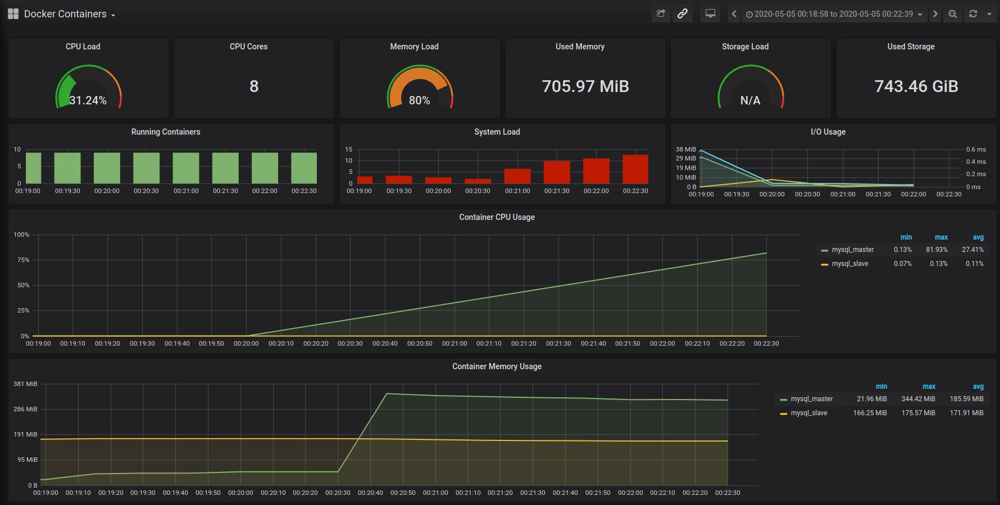
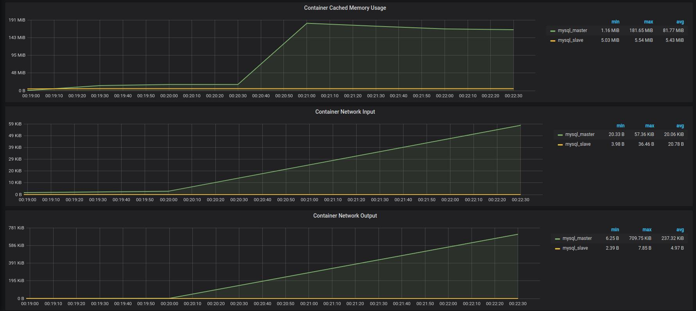
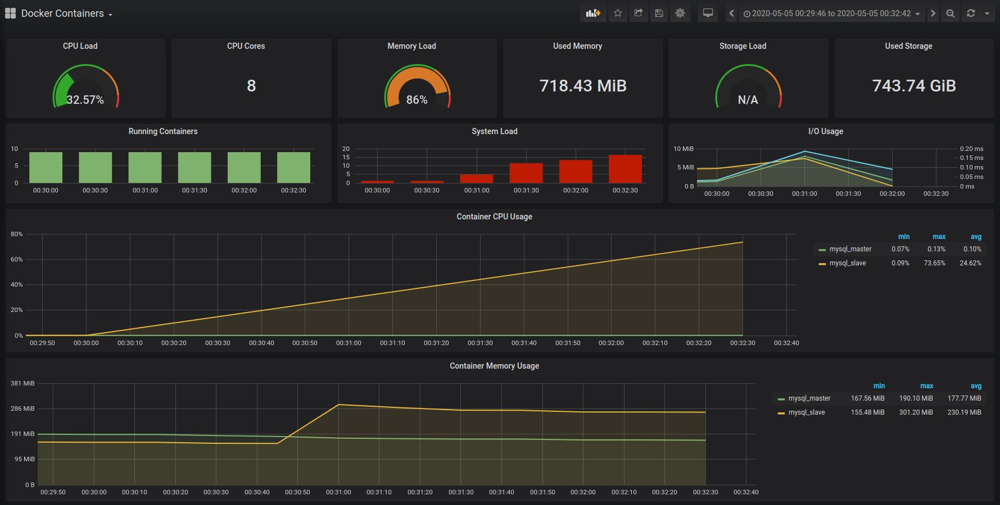
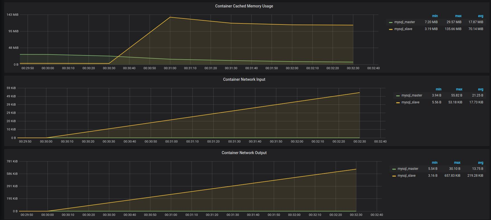

# Настройка репликации

1) Настраиваем асинхронную репликацию.
2) Выбираем 2 любых запроса на чтения (в идеале самых частых и тяжелых по логике работы сайта) и переносим их на чтение со слейва.
3) Делаем нагрузочный тест по странице, которую перевели на слейв до и после репликации. Замеряем нагрузку мастера (CPU, la, disc usage, memory usage).

## Настройка асинхронной репликации

Шаг 1. Настройка Мастера

На сервере, который будет выступать мастером, необходимо внести правки в my.cnf:

```
# выбираем ID сервера, произвольное число
server-id = 1
# путь к бинарному логу
log_bin = /var/lib/mysql/mysql-bin.log
# формат лога
binlog_format = ROW
# название базы данных, которая будет реплицироваться
binlog_do_db = sn
```

Шаг 2. Настройка Слейва

В настройках my.cnf на Слейве необходимо указать такие параметры:

```
# ID Слейва
server-id = 2
# Путь к relay логу
relay-log = /var/lib/mysql/mysql-relay-bin.log
# Путь к bin логу на Мастере
log_bin = /var/lib/mysql/mysql-bin.log
# База данных для репликации
binlog_do_db = sn
```

Шаг 3. Далее на мастере создаем и назначаем права пользователю для реплики:

```sql
create user "sn_slave_user"@"%" identified by "sn_slave_pwd"; 
GRANT REPLICATION SLAVE ON *.* TO "sn_slave_user"@"%"; 
FLUSH PRIVILEGES;
```

Проверяем статус Мастер-сервера:

```sql
SHOW MASTER STATUS;
```

Шаг 4. Настройка подключения к мастеру и запуск репликации на слейве:

```sql
CHANGE MASTER TO MASTER_HOST='172.21.0.2',MASTER_USER='sn_slave_user',MASTER_PASSWORD='sn_slave_pwd',MASTER_LOG_FILE='mysql-bin.000003',MASTER_LOG_POS=4739; 
START SLAVE;
```

Параметры для MASTER_LOG_FILE и MASTER_LOG_POS берем из запроса ```SHOW MASTER STATUS```

Проверяем статус репликации на слейве:

```sql
SHOW SLAVE STATUS;
```

В результате запроса должны быть строки:
```
Name                         |Value                                             
-----------------------------|--------------------------------------------------
Slave_IO_State               |Waiting for master to send event                  
Master_Host                  |172.21.0.2                                        
Master_User                  |sn_slave_user                                     
Master_Port                  |3306                                              
Connect_Retry                |60                                                
Master_Log_File              |mysql-bin.000003                                  
Read_Master_Log_Pos          |4739                                              
Relay_Log_File               |mysql-relay-bin.000002                            
Relay_Log_Pos                |4218                                              
Relay_Master_Log_File        |mysql-bin.000003                                  
Slave_IO_Running             |Yes                                               
Slave_SQL_Running            |Yes                                               

```

## docker-compose с настройками репликации 

см ../../docker/docker-compose.yml

- Добавлен master (настройки /conf/mysql.conf)
- Добавлен slave (настройки /conf/mysql.conf)

Для запуска контейнеров использовать скрипт ./docker/build.sh, 
который настраивает мастер и слейв на репликацию.


## Генерация тестовых данных 

Для генерации тестовых данных используется утилита javafaker

```
1. Удалить в файле ./backend/src/test/kotlin/dev/lysov/sn/FakerTest.kt аннотацию @Disabled
2. Выполнить команду из корня проекта: ./gradlew test --tests "*FakerTest"
3. В результате будет сгенерирован файл insert-account.txt с 1 000 000 записей
4. Запустить докер: ./docker/build.sh
5. Скопировать файл insert-account.txt в запущенный контейнер - master:
docker cp insert-account.txt mysql_master:/var/tmp
6. Подключиться к mysql в докере (имя контейнера = mysql_master)
docker exec -it mysql_master mysql -uroot -ppassw0rd sn
7. Выполнить вставку данных из файла:
LOAD DATA INFILE '/var/tmp/insert-account.txt'
    INTO TABLE account
    FIELDS TERMINATED BY ';'
    (username, password, first_name, last_name, age, gender, city, description)
    SET ID = NULL;

В результате:
Query OK, 1000000 rows affected (17.98 sec)

8. Проверить slave, что данные реплицировались.
```

## Перевод запросов на использование slave

- В коде сконфигурировано 2 dataSource (master, slave)
- Следующие запросы переведены на slave:

```sql
select * from account where first_name like ? and last_name like ?;
select * from account where id = ?;
``` 

## Тестирование

Инструмент НТ: apache-jmeter-5.2.1

Скрипт: ../task03/sn.jmx
-  Arrivals Thread Group
    - Target Rate (arrivals/sec): 200
    - Ramp Up Time (sec): 0
    - Ramp Up Step Count: 1
    - Hold Target Rate Time (sec): 120
    - Concurrency Limit: 100
    - Параметризированный HTTP запрос по CSV файлу

Инструмент мониторинга серверов: Prometheus / Grafana.

Ссылки: 
- https://github.com/vegasbrianc/prometheus
- https://grafana.com/grafana/dashboards/893. 
- https://github.com/stefanprodan/dockprom
- https://habr.com/ru/company/southbridge/blog/314212/.

### До репликации




### После репликации





Как видно по результату мониторинга, нагрузка перешла на слейв.